# 📖 BalloonFly Use Cases

Comprehensive guide to all user flows and scenarios in BalloonFly.

---

## 👤 User Personas

### 1. 🎮 Casual Player
- Plays for fun with small bets
- Prefers safe, early cash-outs
- Enjoys social aspect (watching others)

### 2. 💎 High Roller
- Places large bets
- Takes calculated risks
- Studies patterns and history

### 3. 🤖 Auto-Better
- Uses automatic betting strategies
- Sets predefined cash-out multipliers
- Focuses on long-term profit

### 4. 🔍 Verifier
- Checks provably fair results
- Validates on-chain data
- Ensures game integrity

---

## 🎯 Core Use Cases

### UC-01: Connect Wallet & Start Playing

**Actor:** New Player

**Flow:**
1. Player visits landing page (/)
2. Clicks "Play Now" or "Connect Account"
3. Selects wallet (Freighter, xBull, etc.)
4. Approves connection
5. **Auto-redirected to /game** ✨
6. Sees game interface with current round

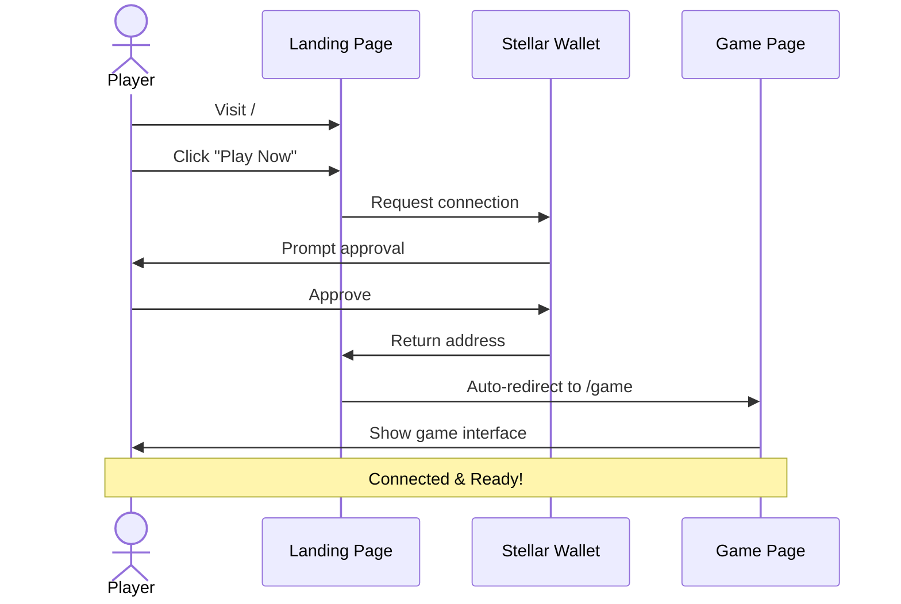

**Success Criteria:**
- ✅ Wallet connected successfully
- ✅ Balance displayed in header
- ✅ Player can see live game

---

### UC-02: Place a Bet (Manual)

**Actor:** Connected Player

**Preconditions:**
- Wallet connected
- Sufficient XLM balance
- Round in "Waiting" or "Flying" phase

**Flow:**
1. Player enters bet amount (e.g., 10 XLM)
2. Optionally sets auto cash-out multiplier
3. Clicks "Place Bet"
4. Wallet prompts for signature
5. Player approves transaction
6. Bet confirmed on-chain
7. Player's bet appears in "Live Bets" list

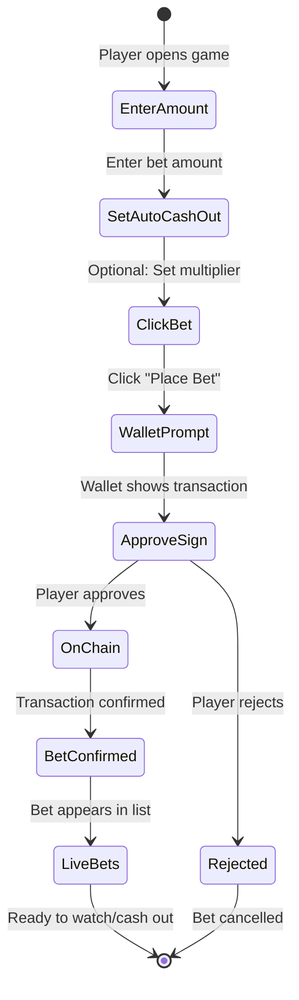

**Edge Cases:**
- 🔄 **Bet during flight:** Goes to next round (queued)
- ❌ **Insufficient balance:** Error message shown
- ⏰ **Round ends:** Bet rejected, try next round

**Success Criteria:**
- ✅ Bet recorded on-chain
- ✅ Balance updated
- ✅ Bet visible in sidebar

---

### UC-03: Cash Out Before Crash

**Actor:** Player with Active Bet

**Preconditions:**
- Player has active bet in current round
- Round is "Flying"
- Balloon hasn't crashed yet

**Flow:**
1. Player monitors multiplier (e.g., 1.00x → 2.45x)
2. Decides to cash out at 2.45x
3. Clicks "Cash Out" button
4. Transaction submitted instantly
5. Winnings calculated: `10 XLM × 2.45 × (1 - 3% fee) = 23.76 XLM`
6. Balance updated immediately
7. Bet marked as "Cashed Out" in list

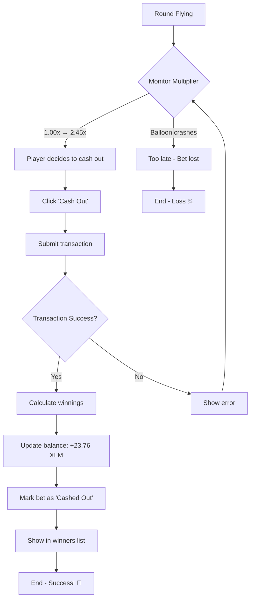

**Success Criteria:**
- ✅ Cash-out processed before crash
- ✅ Correct winnings received
- ✅ Bet status updated

---

### UC-04: Lose When Balloon Crashes

**Actor:** Player with Active Bet

**Preconditions:**
- Player has active bet
- Player hasn't cashed out

**Flow:**
1. Round is flying (e.g., 1.00x → 3.89x)
2. Balloon crashes at 3.89x 💥
3. All uncashed bets lose
4. Player's bet marked as "Lost"
5. Balance unchanged (bet already deducted)
6. New round starts after countdown

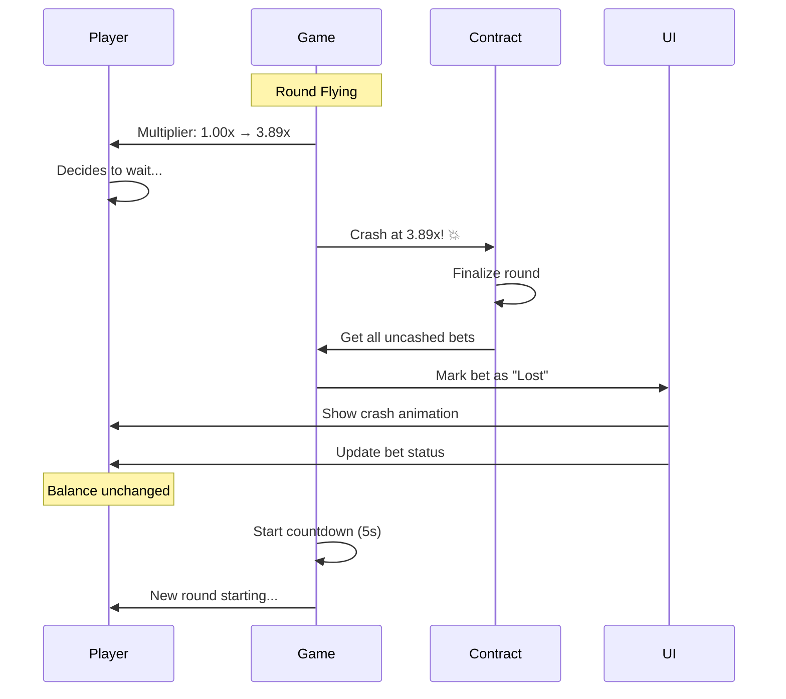

**Success Criteria:**
- ✅ Bet marked as lost
- ✅ No payout received
- ✅ Player can bet in next round

---

### UC-05: Auto-Bet with Target Multiplier

**Actor:** Strategic Player

**Preconditions:**
- Wallet connected
- Sufficient balance for multiple rounds

**Flow:**
1. Player switches to "Automatic" tab
2. Sets bet amount: `5 XLM`
3. Sets auto cash-out: `2.00x`
4. Enables auto-bet
5. **System automatically:**
   - Places 5 XLM bet each round
   - Cashes out at exactly 2.00x (if reached)
   - Loses bet if crash happens before 2.00x
6. Player can stop anytime

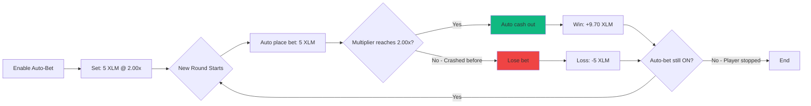

**Success Criteria:**
- ✅ Bets placed automatically
- ✅ Cash-outs at exact multiplier
- ✅ Player can monitor performance

---

### UC-06: View Round History

**Actor:** Any Player

**Flow:**
1. Player scrolls to top of game screen
2. Sees horizontal strip of recent multipliers
3. Multipliers color-coded:
   - 🔵 **Blue**: 1.00x - 1.99x (common)
   - 🟣 **Purple**: 2.00x - 9.99x (medium)
   - 🔴 **Red**: 10.00x+ (rare)
4. Clicks any multiplier
5. Modal opens with round details

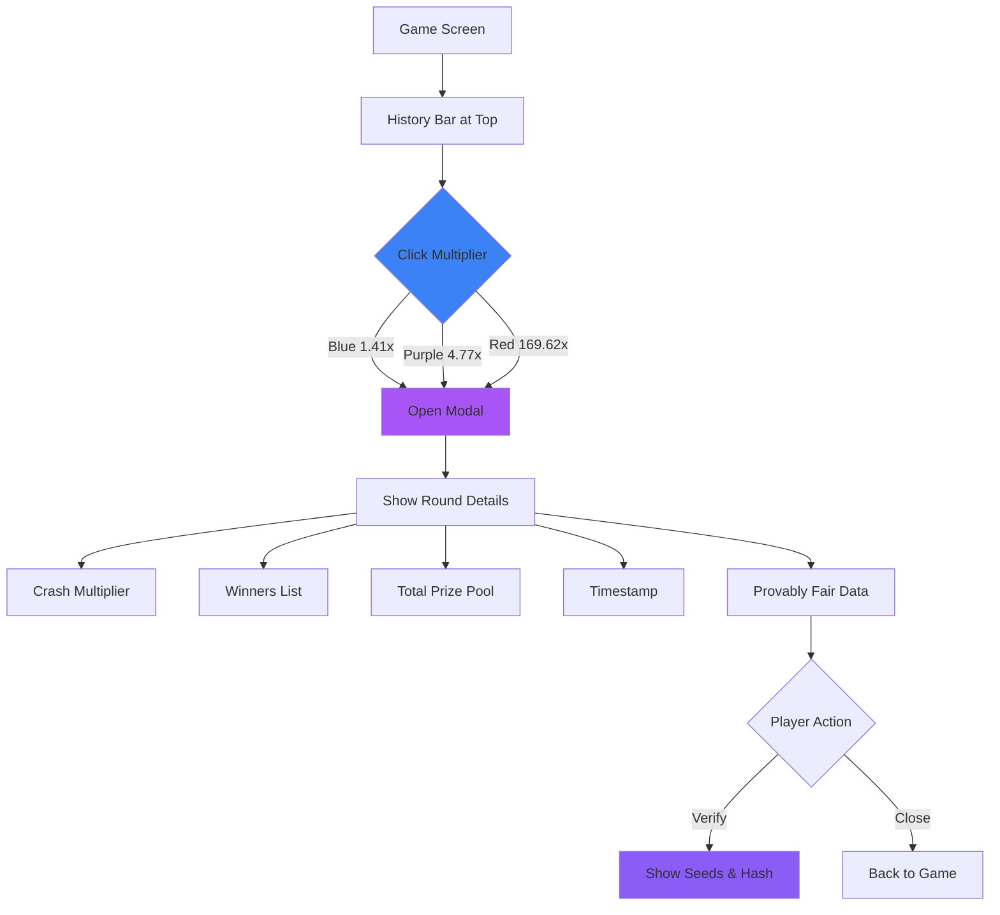

**Success Criteria:**
- ✅ History visible and updated
- ✅ Color-coding correct
- ✅ Details accessible

---

### UC-07: Verify Provably Fair Result

**Actor:** Skeptical Player

**Preconditions:**
- Round has ended
- Server seed revealed

**Flow:**
1. Player clicks "🔒 Provably Fair" button
2. Modal shows:
   - Server seed hash (pre-published)
   - Revealed server seed (after crash)
   - Client seeds (from first 3 bets)
   - Combined hash
   - Crash multiplier calculation
3. Player can verify independently:
   ```javascript
   hash = SHA256(serverSeed + clientSeed1 + clientSeed2 + clientSeed3)
   multiplier = calculateFromHash(hash)
   ```
4. Player confirms calculation matches

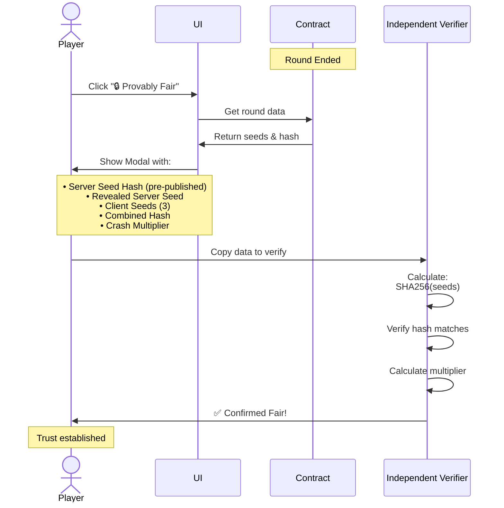

**Success Criteria:**
- ✅ All seeds visible
- ✅ Hash calculation correct
- ✅ Multiplier verifiable

---

### UC-08: Watch Live Game (Spectator)

**Actor:** Visitor without Wallet

**Flow:**
1. Visitor opens /game
2. Sees game running but can't bet
3. Watches:
   - Live multiplier updates
   - Other players' bets
   - Cash-outs in real-time
   - Round history
4. Connects wallet when ready to play

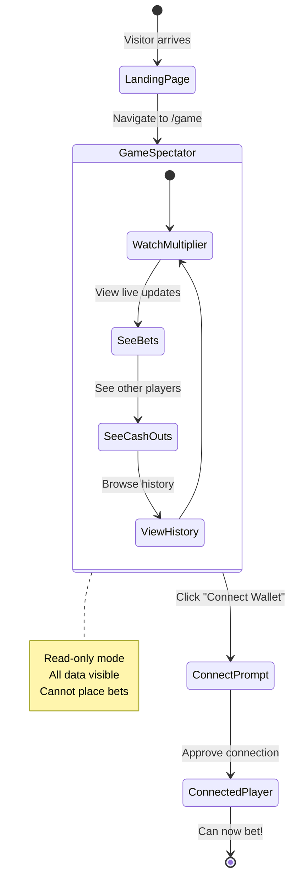

**Success Criteria:**
- ✅ Game visible without connection
- ✅ Live updates work
- ✅ Clear prompt to connect

---

## 🔄 Round Lifecycle

### Detailed Flow

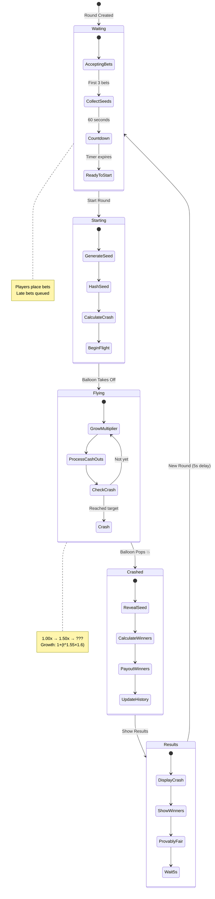

**Phase Durations:**
- ⏰ Waiting: 60 seconds
- ⚡ Starting: < 1 second
- 🎈 Flying: Variable (until crash)
- 💥 Crashed: Instant
- 📊 Results: 5 seconds

---

## 💰 Payout Examples

### Example 1: Early Cash-Out Win

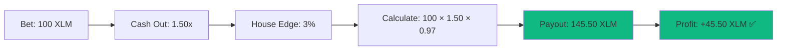

### Example 2: Late Cash-Out Win

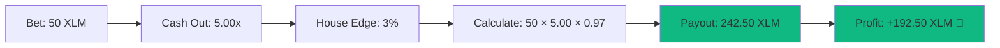

### Example 3: Loss (No Cash-Out)

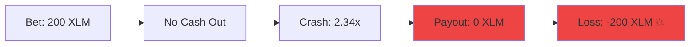

### Example 4: Auto-Bet Strategy (10 rounds)

```
Bet per round: 10 XLM
Auto cash-out: 2.00x
Target: 19.40 XLM per win (10 × 2.00 × 0.97)

Results:
Round 1: Win at 2.00x → +9.40 XLM
Round 2: Crash at 1.85x → -10.00 XLM
Round 3: Win at 2.00x → +9.40 XLM
Round 4: Win at 2.00x → +9.40 XLM
Round 5: Crash at 1.22x → -10.00 XLM
Round 6: Win at 2.00x → +9.40 XLM
Round 7: Win at 2.00x → +9.40 XLM
Round 8: Crash at 1.99x → -10.00 XLM
Round 9: Win at 2.00x → +9.40 XLM
Round 10: Win at 2.00x → +9.40 XLM

Total Profit: +46.40 XLM (7 wins, 3 losses)
```

---

## 🎯 Advanced Scenarios

### Scenario A: Multiple Players Same Round

**Setup:**
- Alice bets 10 XLM
- Bob bets 50 XLM  
- Charlie bets 100 XLM
- Crash at 3.50x

```mermaid
gantt
    title Round Timeline - Multiple Players
    dateFormat X
    axisFormat %Lx
    
    section Alice
    Bet placed (10 XLM)    :0, 10
    Cash out @ 2.00x       :10, 20
    Wins 19.40 XLM         :20, 30
    
    section Bob
    Bet placed (50 XLM)    :0, 10
    Cash out @ 3.00x       :10, 30
    Wins 145.50 XLM        :30, 40
    
    section Charlie
    Bet placed (100 XLM)   :0, 10
    Waiting...             :10, 35
    Loses (no cash-out)    :35, 40
    
    section Round
    Crash @ 3.50x          :crit, 35, 40
```

**Outcome:**
- Alice cashes out at 2.00x → Wins 19.40 XLM ✅
- Bob cashes out at 3.00x → Wins 145.50 XLM ✅
- Charlie doesn't cash out → Loses 100 XLM ❌

### Scenario B: Bet During Flight

**Setup:**
- Round started, multiplier at 1.80x
- Player tries to place bet

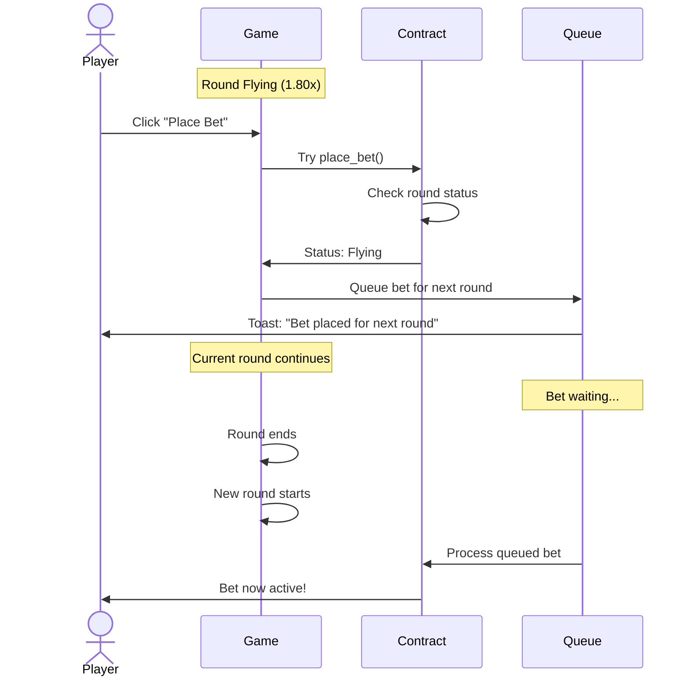

**Outcome:**
- Bet rejected for current round
- Bet queued for next round
- Toast message: "Bet placed for next round"

### Scenario C: Network Disconnect

**Setup:**
- Player has active bet
- Internet disconnects during flight

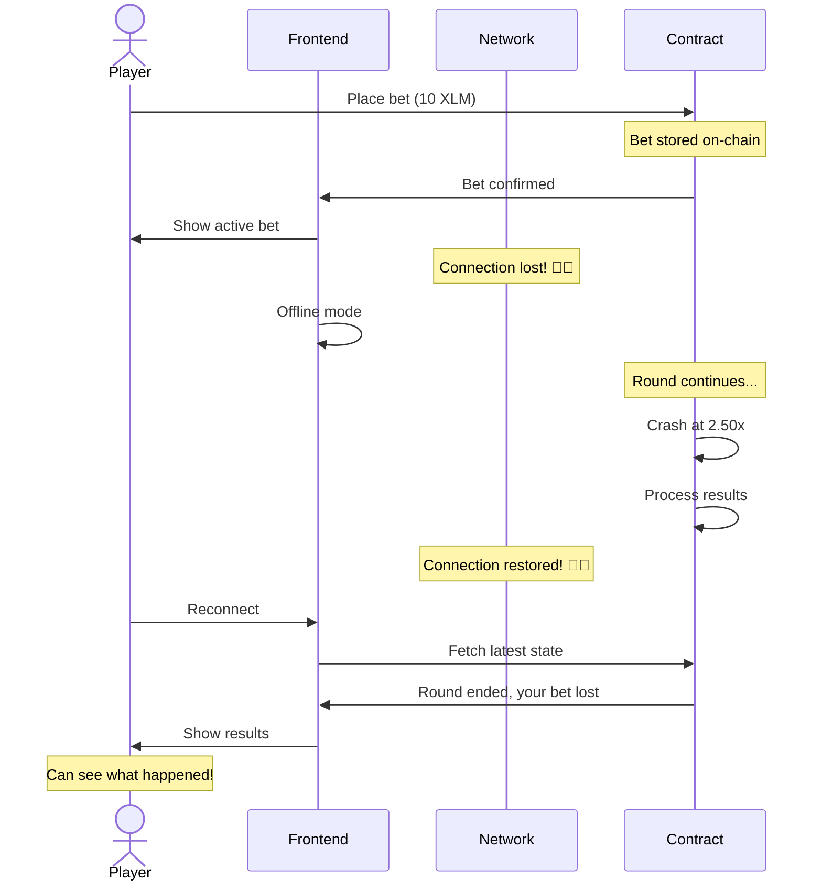

**Outcome:**
- Bet still valid on-chain
- Player can reconnect and continue
- If crashed, result visible after reconnect

---

## 📊 Statistics Tracking

Players can track:
- Total bets placed
- Win rate (%)
- Average cash-out multiplier
- Biggest win
- Total profit/loss
- Rounds played

---

## 🔐 Security Use Cases

### SEC-01: Prevent Double Cash-Out

**Attack:** Player tries to cash out twice

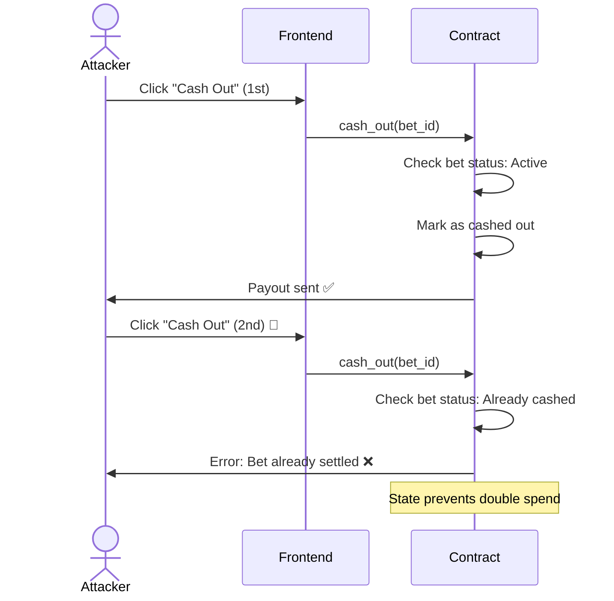

**Prevention:**
- On-chain state checked
- First cash-out invalidates bet
- Second attempt rejected

### SEC-02: Verify Fair Crash

**Scenario:** Player suspects rigged game

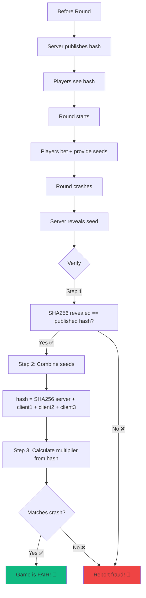

**Solution:**
1. Get server seed hash (before round)
2. Round completes
3. Server seed revealed
4. Verify: `SHA256(revealed) === hash`
5. Calculate multiplier from seeds
6. Confirm crash was predetermined

---

## 🎓 Learning Path

### Beginner
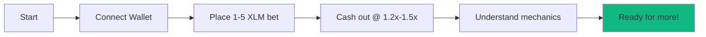

### Intermediate
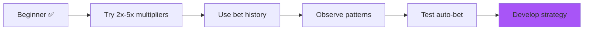

### Advanced
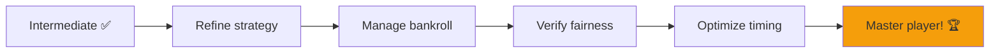

---

**Ready to play? Check [QUICK_START.md](./QUICK_START.md)!** 🎈
